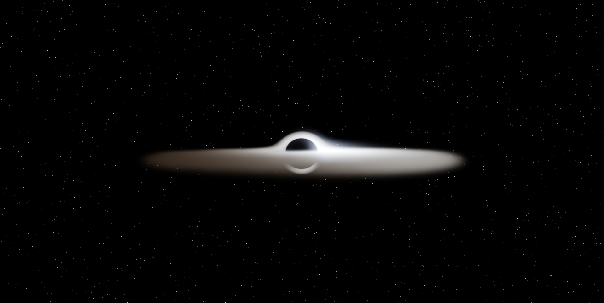

# Black Hole Simulation

A physically-accurate, real-time ray-marched rendering of a Schwarzschild black hole with an accretion disk. Written in Python using **Taichi** for GPU-accelerated computation, this simulation follows the actual equations of general relativity to produce visuals matching observations like the Event Horizon Telescope.

## Preview



*A ray-marched Schwarzschild black hole with an accretion disk, showing the photon ring, event horizon shadow, and relativistic Doppler asymmetry (approaching side brighter).*

## Features

- **Schwarzschild Geodesics:** Integrates true null-geodesic photon paths (`d²u/dφ² + u = 3Mu²`), not fake Newtonian forces. Produces the characteristic **photon ring** and **secondary disk image** arcing over the black hole's pole.
- **Novikov-Thorne Disk:** Physically-correct accretion disk with temperature profile `T(r) = T_max · (r_isco/r)^(3/4) · [1−√(r_isco/r)]^(1/4)`. Peaks near the ISCO, zero at the inner boundary.
- **Stefan-Boltzmann Radiation:** Disk intensity scales as `T⁴` (Stefan-Boltzmann law), not the arbitrary `T²`. Combined with proper blackbody color rendering.
- **Relativistic Doppler & Beaming:** Full relativistic Doppler factor `𝒟 = 1/[γ(1−β·n̂)]` with `𝒟⁴` transport (Liouville's theorem). Makes the approaching disk side blue-white and bright, the receding side red and dim.
- **Gravitational Redshift:** Light climbing out of the potential well loses energy, shifting colors toward red and dimming the inner disk.
- **Jet Synchrotron Glow:** Subtle relativistic jets along the polar axis.
- **Real-Time Rendering:** Leverages NVIDIA CUDA (via Taichi) for GPU acceleration at interactive frame rates.
- **Interactive Camera:** Orbit, zoom, and toggle auto-rotation around the black hole.

## Requirements

- **Python 3.8+**
- **Taichi** library (with CUDA support for GPU acceleration)
- **NVIDIA GPU** (GeForce GTX 1050+, RTX series recommended) — optional but strongly recommended for interactive frame rates

## Installation

### 1. Clone or download this repository
```bash
git clone https://github.com/Balaji120533/black-hole-simulation.git
cd black-hole-simulation
```

### 2. Set up a Python virtual environment (recommended)
```bash
python -m venv .venv
```
**Windows:**
```bash
.venv\Scripts\activate
```
**macOS/Linux:**
```bash
source .venv/bin/activate
```

### 3. Install Taichi
```bash
pip install taichi
```

The code uses `ti.init(arch=ti.gpu)` to enable GPU acceleration if your system has CUDA support. If GPU is not available or CUDA is not installed, Taichi will fall back to CPU (single-threaded, much slower).

## Usage

Run the simulation (ensure your virtual environment is activated):

```bash
python blackhole.py
```

A window will open with the real-time black hole renderer. The first run may take a few seconds to compile the Taichi kernels.

### Controls
- **Left Mouse Button + Drag:** Orbit the camera around the black hole.
- **W / S Keys:** Zoom in / out.
- **R Key:** Toggle auto-rotation mode.
- **ESC Key:** Exit the simulation.

## Physics Behind the Simulation

### Core Concepts
- **Schwarzschild Black Hole:** Non-rotating black hole described by the Schwarzschild metric.
- **Event Horizon:** Point of no return at the Schwarzschild radius `Rs = 2M`.
- **Photon Sphere:** Circular orbit at `1.5·Rs` where light can orbit but is unstable.
- **ISCO (Innermost Stable Circular Orbit):** At `3·Rs`, the inner edge of the accretion disk.

### Disk Physics
- **Novikov-Thorne Profile:** Temperature profile of an accretion disk around a black hole: `T(r) = T_max · (r_isco/r)^(3/4) · [1−√(r_isco/r)]^(1/4)`
- **Stefan-Boltzmann Radiation:** Disk brightness scales as `T⁴` (physically correct).
- **Blackbody Emission:** Uses Planck spectrum approximation for realistic colors based on temperature.

### Relativistic Effects
- **Gravitational Lensing:** Photons follow null geodesics in curved spacetime, not straight lines. The simulation integrates `d²u/dφ² + u = 3Mu²`, producing the photon ring and secondary disk image.
- **Gravitational Redshift:** Light climbing out of the black hole's potential well loses energy, shifting toward red.
- **Relativistic Doppler Effect:** Matter moving at high velocities beams its light — the approaching side appears blue-white and bright, the receding side appears red and dim.
- **Beaming Factor:** The observed intensity scales as `𝒟⁴` where `𝒟` is the relativistic Doppler factor, accounting for how moving material concentrates radiation in the forward direction.

## Performance Notes

- **GPU (NVIDIA with CUDA):** ~20-40 fps at 1920×1080 on RTX 3050 or better.
- **CPU:** ~1-5 fps (not recommended for interactive use).
- The simulation uses adaptive ray-marching with smaller steps near the photon sphere for accuracy.
